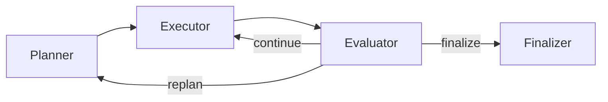

# Architecture Overview

Asterism runs a LangGraph-based planning loop:

## Core Components

- `asterism/agent/agent.py`: graph lifecycle, invoke/stream APIs, usage aggregation
- `asterism/agent/state/agent_state.py`: shared workflow state
- `asterism/agent/nodes/*`: planner/executor/evaluator/finalizer nodes
- `asterism/mcp/executor.py`: MCP tool execution and transport management
- `asterism/api/*`: OpenAI-compatible HTTP surface
