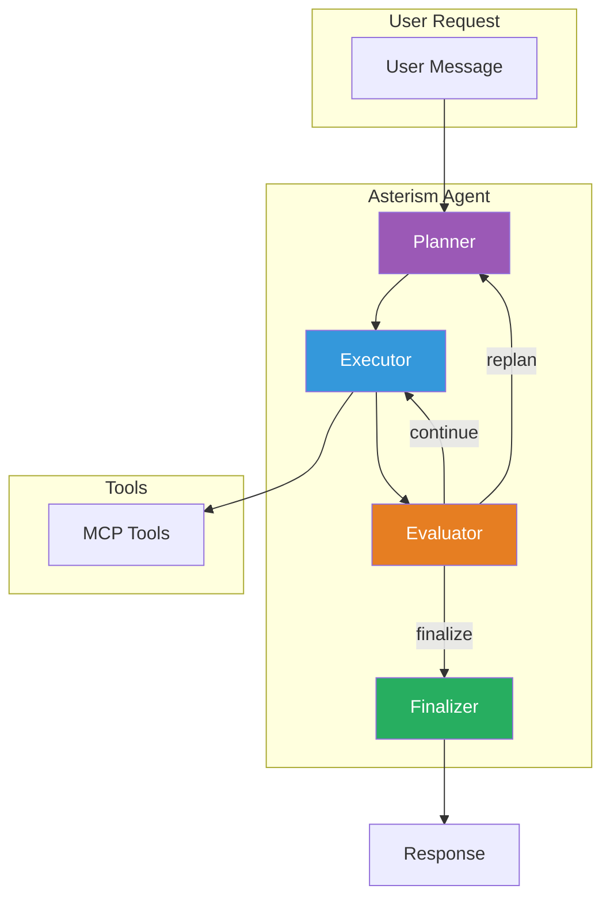

# Welcome to Asterism

Asterism is a high-performance AI agent framework built with **LangGraph** for workflow orchestration and **MCP (Model Context Protocol)** for tool execution. It provides an OpenAI-compatible API that enables you to create autonomous agents capable of planning, executing, and managing complex tasks.

## Why Asterism?

In a world of AI systems that rush, deceive, or dehumanize, Asterism chooses a different path:

- **Depth over speed** — Good navigation takes time. Rushing leads to wrong turns.
- **Truth over convenience** — It is easier to guess than to admit uncertainty. We choose honesty.
- **Partnership over automation** — You are not a prompt to be optimized. You are a person with goals.
- **Craft over minimum viable** — "Good enough" is rarely good enough. We take pride in excellence.
- **Growth over stagnation** — Every conversation makes the agent more useful for the next.

## Key Features

<div class="grid cards" markdown>

-   ### Plan-Execute-Evaluate Cycle

    Hierarchical agent workflow with automatic retry logic for robust task completion.

-   ### Dynamic LLM Abstraction

    Plug-and-play provider architecture supporting multiple LLM backends (OpenAI, OpenRouter, etc.).

-   ### Multi-Transport MCP

    Support for stdio, http_stream, and SSE transport protocols for flexible tool integration.

-   ### Runtime Persona Configuration

    Dynamically load agent personality through SOUL.md, AGENT.md, and PERSONALITY.md files.

-   ### Robust JSON Parsing

    Automatic retry with markdown extraction fallback for reliable structured outputs.

-   ### Comprehensive Logging

    Full debugging visibility across all agent nodes for troubleshooting.

</div>

## Quick Navigation

!!! tip "New to Asterism?"

    Start with the [Getting Started](getting-started/installation.md) guide to set up your first agent in minutes.

| I want to... | Read this... |
|--------------|--------------|
| Install Asterism | [Installation](getting-started/installation.md) |
| Run the API server | [Quick Start](getting-started/quick-start.md) |
| Configure the agent | [Configuration](configuration/config-yaml.md) |
| Understand the API | [API Reference](api-reference/overview.md) |
| Add custom tools | [MCP Integration](mcp/overview.md) |
| Customize the agent personality | [Workspace](workspace/overview.md) |
| Understand how it works | [Architecture](architecture/overview.md) |

## Architecture Overview



## Example Usage

Once running, you can interact with Asterism using the OpenAI-compatible API:

```bash
curl -X POST http://localhost:20820/v1/chat/completions \
  -H "Content-Type: application/json" \
  -H "Authorization: Bearer YOUR_API_KEY" \
  -d '{
    "model": "llmgateway/psn/Nusa-Max",
    "messages": [{"role": "user", "content": "Hello! What can you help me with?"}]
  }'
```

## Open Source

Asterism is open source and available on [GitHub](https://github.com/rizquuula/Asterism). We welcome contributions!

---

*Built with care for those who value quality over speed, and truth over convenience.*
